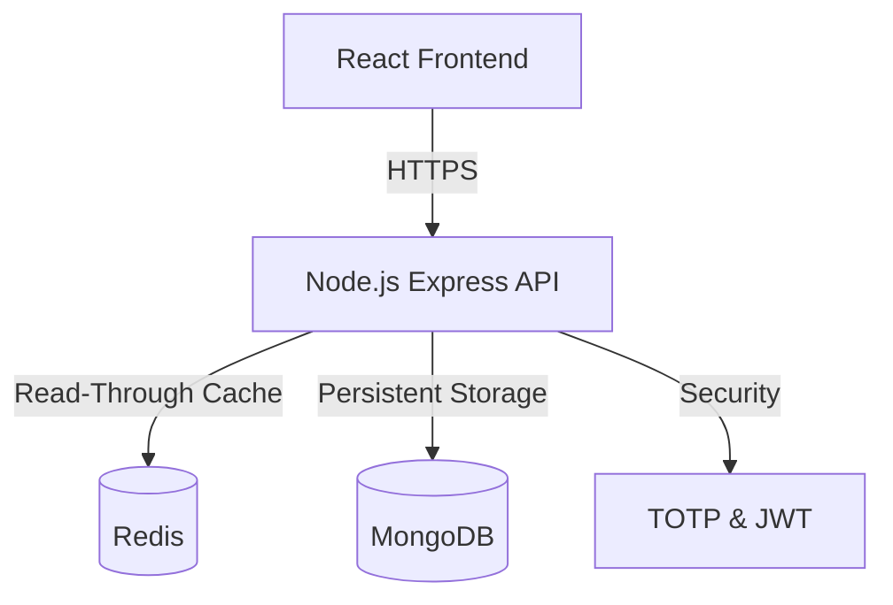
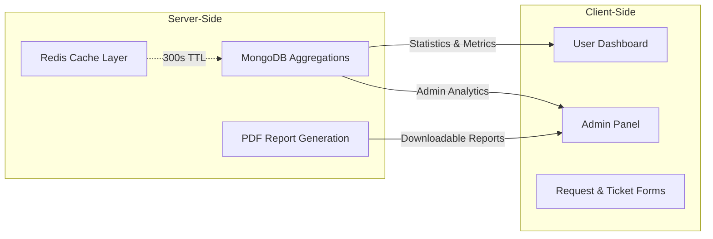

# IT Asset Management Portal


A comprehensive inventory management system designed for enterprise IT operations. This application centralizes hardware tracking, software license management, and employee procurement workflows into a single secure platform. It is engineered to handle complex state changes using a distributed caching layer.

## System Overview

* **Performance & Caching:** Utilizes [Redis](https://redis.io/) to cache high-frequency read operations (such as asset listings and statistics), significantly reducing load on the primary MongoDB database during peak traffic.
* **Security Architecture:** Implements a secure authentication flow using JWTs in http-only cookies to prevent XSS. Critical actions are protected by [Speakeasy (TOTP)](https://github.com/speakeasyjs/speakeasy), Rate Limiting, and strict Role-Based Access Control (RBAC).
* **Data Processing:** Leverages [MongoDB Aggregation Pipelines](https://www.mongodb.com/docs/manual/core/aggregation-pipeline/) for server-side statistics and reporting. Includes PDF report generation for assets, tickets, and audit logs.
* **Asset Lifecycle:** Enforces a structured state machine for assets (Available → Assigned → Maintenance → Retired), ensuring audit trails are maintained for every status change.

## Architecture

The system follows a tiered architecture separating the client, API, and data layers, containerized via Docker.

### High-Level Infrastructure



### Functional Logic Distribution


## Getting Started

1. Clone the Repository
```text
git clone [https://github.com/vinamras19/it-asset-management-portal.git]
cd it-asset-management-portal
```
2. Configure Environment Create a .env file in the root directory.

```bash
MONGO_URI=mongodb://mongo:27017/it_asset_management
UPSTASH_REDIS_URL=redis://redis:6379
ACCESS_TOKEN_SECRET=your_access_secret_key
REFRESH_TOKEN_SECRET=your_refresh_secret_key
CLIENT_URL=http://localhost:5000
CLOUDINARY_CLOUD_NAME=your_cloud_name
CLOUDINARY_API_KEY=your_api_key
CLOUDINARY_API_SECRET=your_api_secret
```
3. Run with Docker - Builds the frontend, sets up the backend, and starts the database containers.

```bash
docker-compose up --build -d
```
4. Seed the Database Populate the system with initial users, assets, and request history for testing. (seed.js)

```bash
docker-compose exec app npm run seed
```

## Verification & Testing

To verify the system is running correctly:

1. Portal Access:

```text
URL: http://localhost:5000

Test Credentials:

Admin:    admin@vsitcompany.com / Admin@123     (Full system access)
Manager:  manager@vsitcompany.com / Manager@123 (Asset & request management)
Auditor:  auditor@vsitcompany.com / Auditor@123 (Read-only audit access)
Employee: employee@vsitcompany.com / User@123   (Request assets & tickets)
```
2. Caching Verification: 

```text
Open Developer Tools (F12) → Network Tab
Refresh the Assets page or Admin Dashboard

First Load: ~100-200ms (fetched from MongoDB)
Subsequent Loads: <20ms (served from Redis cache)
```

3. Procurement Workflow:

```text
Login as employee → Browse Asset Catalog → Add items to request → Submit request
     ↓
Login as manager → Navigate to "Manage Requests" → Approve/Reject pending request
     ↓
On approval + fulfillment → Asset status changes to "assigned" automatically
     ↓
Check "Audit Logs" in Admin panel to confirm transaction recorded
```

## API Routes

**Auth** `/api/auth`
```
POST   /signup, /login, /logout, /refresh-token
POST   /forgot-password, /reset-password/:token
GET    /profile, /users
PUT    /profile, /change-password
```

**Assets** `/api/assets`
```
GET    /                   → list all
GET    /:id                → single asset
GET    /stats              → aggregated counts
GET    /search?query=      → search
GET    /assigned/:userId   → user's assets
GET    /export/csv         → download CSV
POST   /                   → create (admin)
PUT    /:id                → update (admin)
DELETE /:id                → delete (admin)
```

**Requests** `/api/requests`
```
GET    /my                 → user's requests
GET    /admin/all          → all requests (admin)
GET    /admin/stats        → stats
POST   /                   → submit request
PATCH  /:id/status         → approve/reject (admin)
PATCH  /:id/cancel         → cancel own request
```

**Tickets** `/api/tickets`
```
GET    /                   → list
GET    /:id                → details + comments
POST   /                   → create
POST   /:id/comments       → add comment
PATCH  /:id                → update status (admin)
DELETE /:id                → delete (admin)
```

**Licenses** `/api/licenses`
```
GET    /                   → list
POST   /                   → create (admin)
DELETE /:id                → delete (admin)
```

**2FA** `/api/2fa`
```
GET    /status             → check if enabled
POST   /generate           → get QR code
POST   /verify-setup       → enable 2FA
POST   /verify-login       → verify on login
POST   /disable            → disable 2FA
```

**Reports** `/api/reports`
```
GET    /assets             → PDF inventory
GET    /tickets            → PDF ticket summary
GET    /audit              → PDF audit log
```

## License
See `LICENSE` for more information.

> **Note:** This project was developed in Q3 2025. Source code migrated to public repository in Jan 2026.