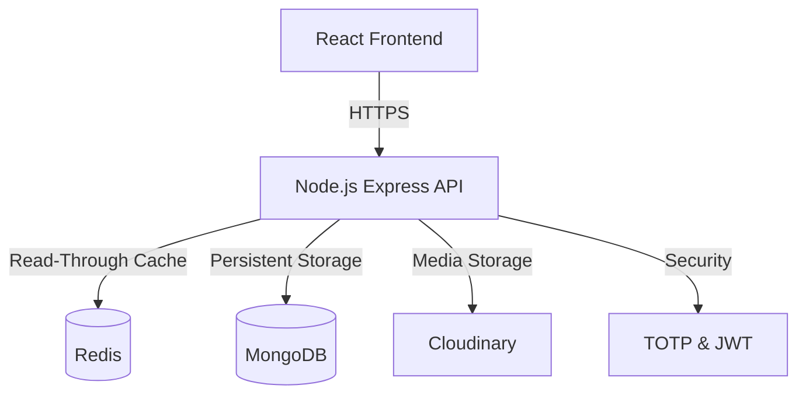

# IT Asset Management Portal


A comprehensive inventory management system designed for enterprise IT operations. This application centralizes hardware tracking, software license management, and employee procurement workflows into a single secure platform. It is engineered to handle complex state changes and real-time analytics using a distributed caching layer.

## System Overview

* **Performance & Caching:** Utilizes [Redis](https://redis.io/) to cache high-frequency read operations (such as dashboard analytics and category counts), significantly reducing load on the primary MongoDB database during peak traffic.
* **Security Architecture:** Implements a secure authentication flow using JWTs in http-only cookies to prevent XSS. Critical actions are protected by [Speakeasy (TOTP)](https://github.com/speakeasyjs/speakeasy), Rate Limiting, and strict Role-Based Access Control (RBAC).
* **Data Processing:** Leverages [MongoDB Aggregation Pipelines](https://www.mongodb.com/docs/manual/core/aggregation-pipeline/) to perform server-side calculations for asset depreciation, current value, and carbon footprint analysis, removing processing overhead from the application layer.
* **Asset Lifecycle:** Enforces a structured state machine for assets (Procured → Available → Allocated → Maintenance → Retired), ensuring audit trails are maintained for every status change.

## Architecture

The system follows a tiered architecture separating the client, API, and data layers, containerized via Docker.



## Getting Started

1. Clone the Repository
```text
git clone [https://github.com/yourusername/it-asset-portal.git](https://github.com/yourusername/it-asset-portal.git)
cd it-asset-portal
```
2. Configure Environment Create a .env file in the root directory (refer to .env.example).
```text
MONGO_URI=mongodb://mongo:27017/it_asset_management
UPSTASH_REDIS_URL=redis://redis:6379
ACCESS_TOKEN_SECRET=your_secret_key
REFRESH_TOKEN_SECRET=your_refresh_secret
CLIENT_URL=http://localhost:5000
```
3. Run with Docker - Builds the frontend, sets up the backend, and starts the database containers.
```text
docker-compose up --build -d
```
4. Seed the Database Populate the system with initial users, assets, and request history for testing. (seed.js)
```text
docker-compose exec app npm run seed
```

## Verification & Testing

To verify the system is running correctly:

1. Portal Access:
```text
URL: http://localhost:5000

Credentials: 
1. Administrator - admin@vsitcompany.com/Admin@123 (Full Access to users, reports, settings)
2. Manager - warehouse@vsitcompany.com/Warehouse@123 (Asset Management & Approvals)
3. Employee - john.smith@vsitcompany.com/User@123 (Request Assets & View Catalog)

Check: Notice that the "Admin Dashboard" loads with charts visible.
```
2. Caching Verification: Make a request to the analytics endpoint. The first request should take ~100-200ms (DB fetch), and subsequent requests should take <10ms (Redis hit).
```text
curl -I http://localhost:5000/api/analytics
```
3. Procurement Workflow:
```text
Login as employee → Add an item to your selection and submit a request → Login as warehouse@vsitcompany.com (Manager role) → Navigate to "Requests" and approve the pending item → Check the "Audit Logs" in the Admin panel to confirm the transaction was recorded
```
## License
See `LICENSE` for more information.

> **Note:** This project was architected and developed in Q3 2025. Source code migrated to public repository in Jan 2026.